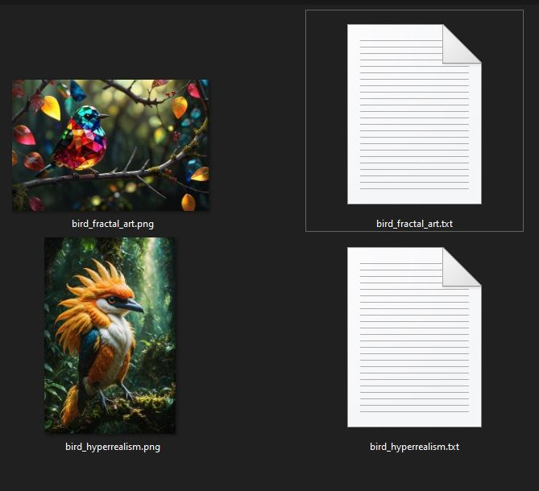

## About

Standalone util to caption images for lora or stable-diffusion training. No server required - fully local, modifiable, minimalistic.

Flow:
 - Select images
 - Modify existing embedded prompt (only for png with tEXt Textual embedding - e.g. Automatic1111 generated images)
 - Iterate over all images
 - Export the captions (naming of .txt always respective to img file)
 - Use captions and images with [kohya](https://github.com/bmaltais/kohya_ss) or any other training framework

<br>
<br>


*Demo*

<br>



*Exported captions*

## Run 

```bash
$ npm install
```

```bash
$ npm run dev
```

open `localhost:3000`

**Images used for demo**
* https://civitai.com/images/20191669
* https://civitai.com/images/19370040
* https://civitai.com/images/13194325
